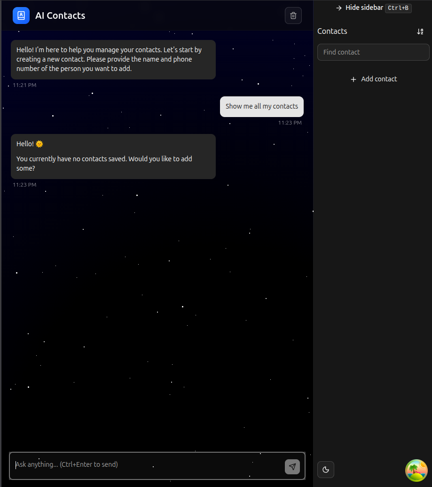
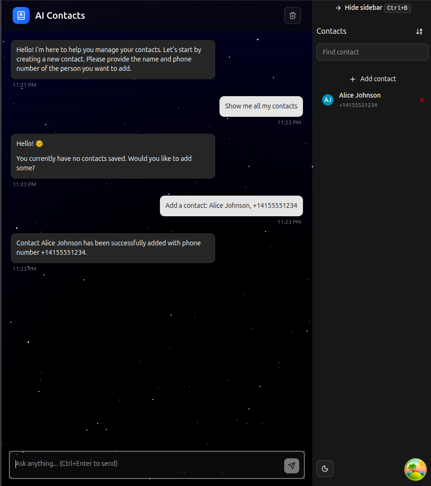
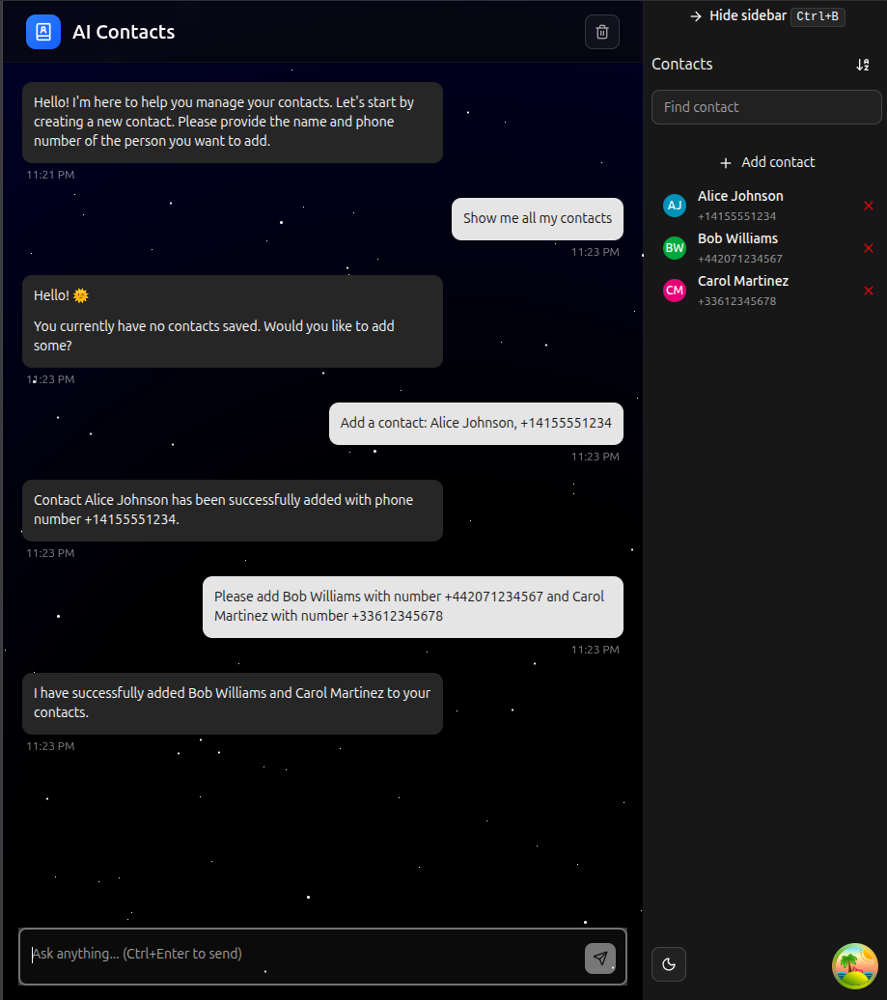
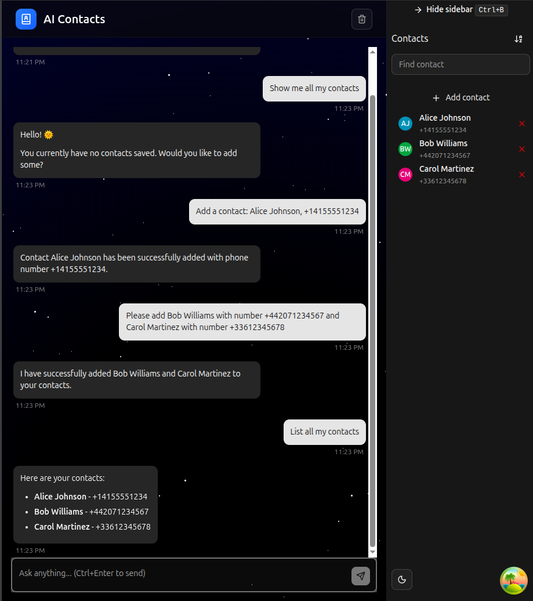
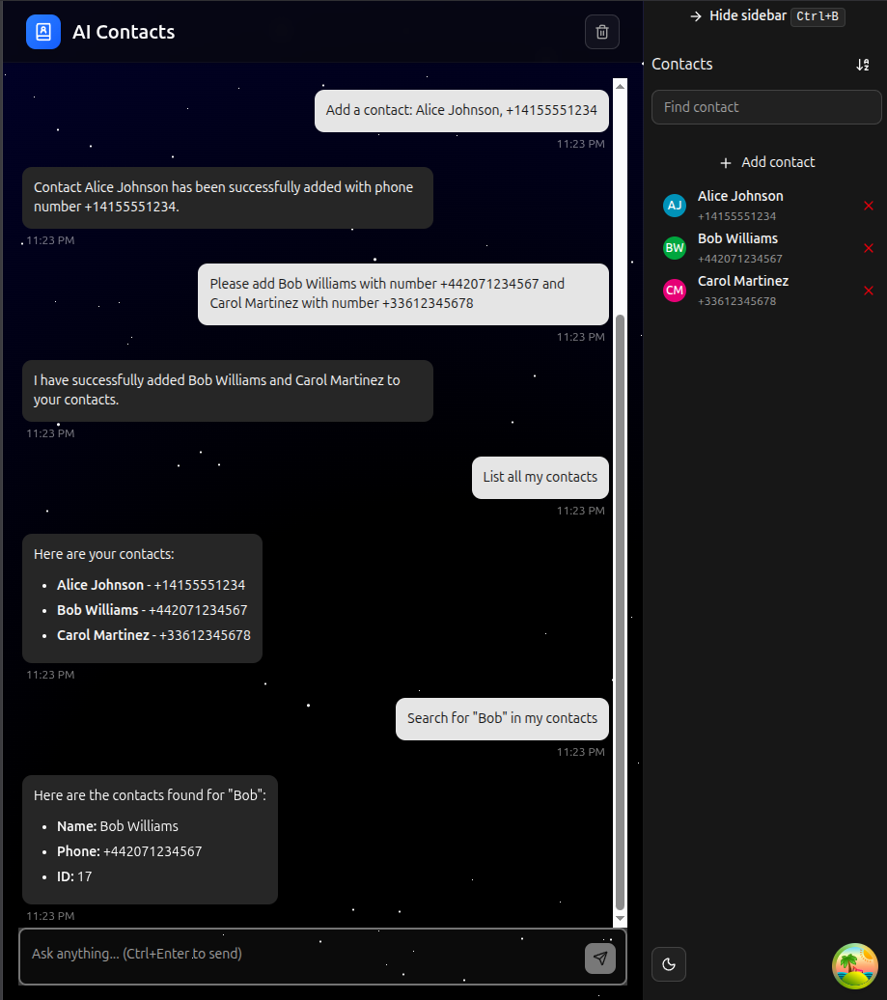
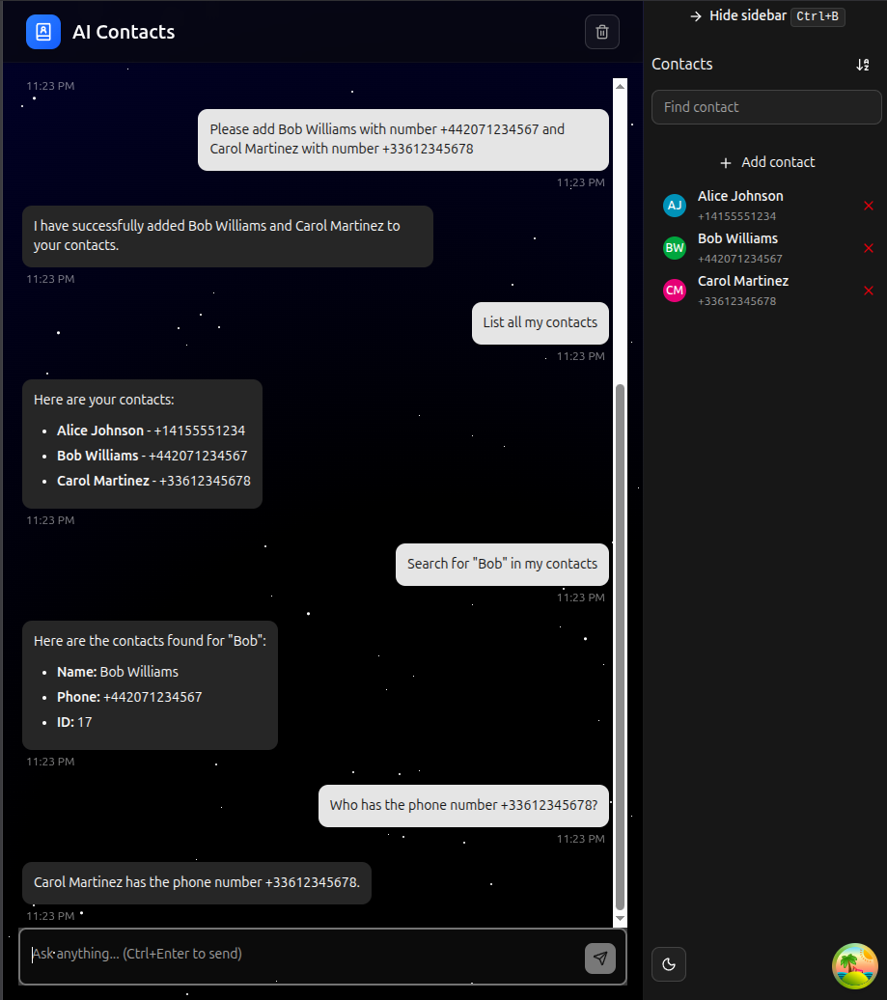
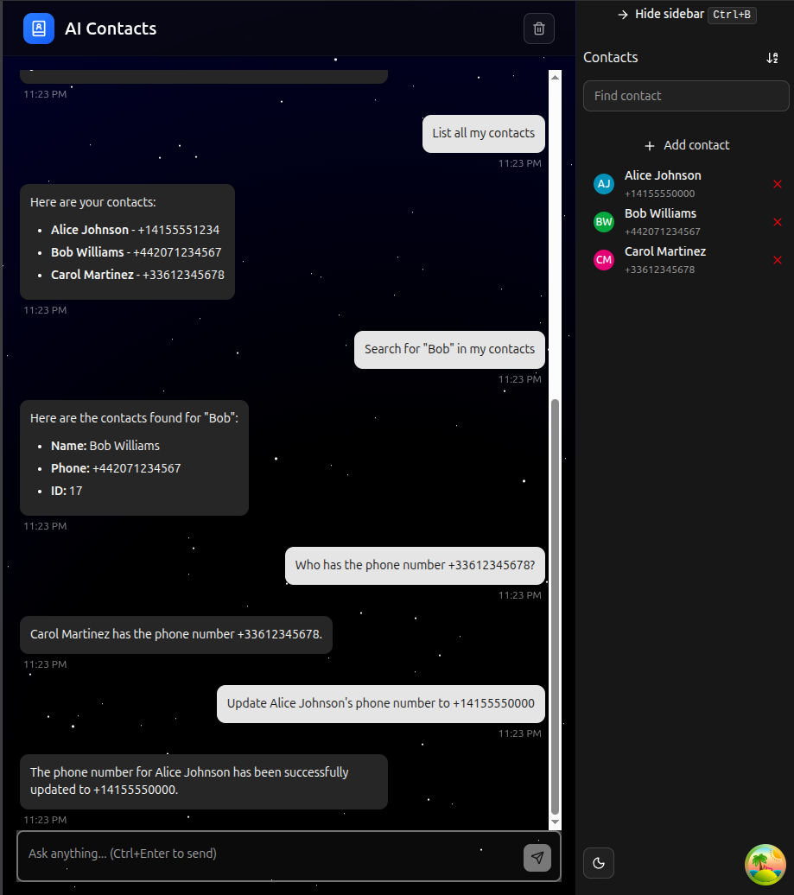
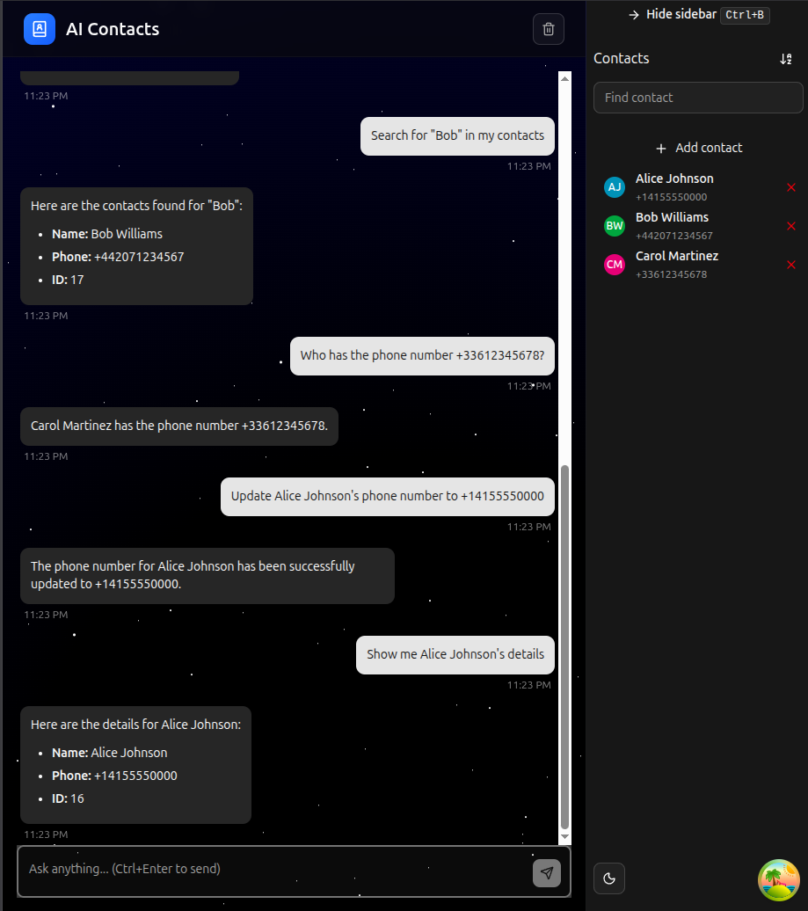
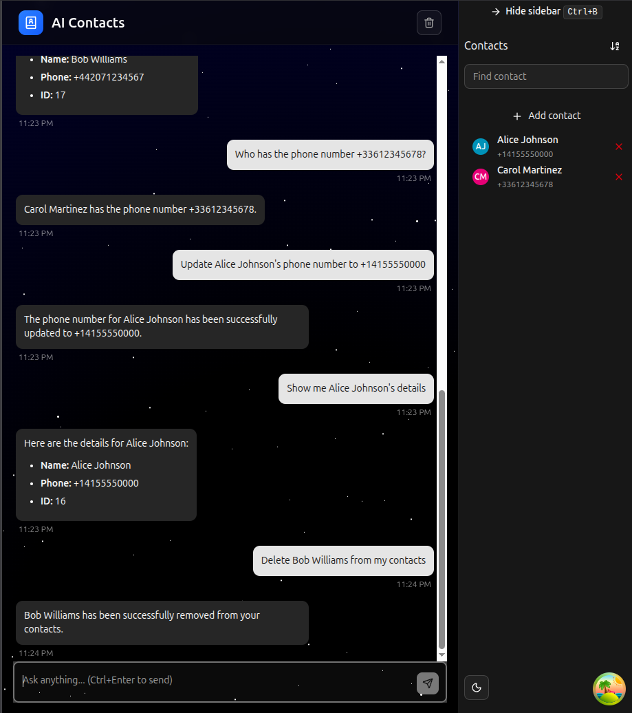
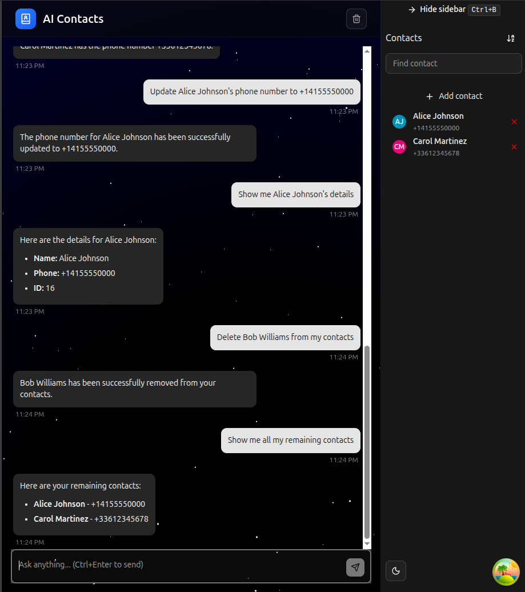

# AI Contacts

Full-stack AI-powered contact management app. Chat with an AI assistant to create, search, update, and delete contacts using natural language.

## Screenshots

### Empty state

Ask the assistant to show contacts when the book is empty.



### Adding a contact

Create a new contact with name and phone number.



### Bulk add

Add multiple contacts in a single message.



### Listing contacts

View all contacts in a formatted list.



### Searching by name

Find contacts by searching for a name.



### Finding by phone number

Look up a contact by their phone number.



### Updating a contact

Update a contact's information by name.



### Verifying the update

Confirm the update was applied correctly.



### Deleting a contact

Remove a contact by name.



### Final overview

View the remaining contacts after all changes.



## Quick Start

```bash
# 1. Clone and setup
git clone <repository-url>
cd swe_assessment

# 2. Create environment files
# - Create `db/.env` from `db/.env.example`
# - Add GOOGLE_API_KEY to `backend/.env` (get free key: https://aistudio.google.com/app/apikey)
# - Ensure db credentials match between `db/.env` and `backend/.env`

# 3. Run application
docker-compose -f compose.local.yml up --build
```

## Access URLs

- **Frontend**: <http://localhost:3000>
- **API**: <http://localhost:8000> ([Docs](http://localhost:8000/docs))
- **Database Admin**: <http://localhost:8080> (root/example)

## Tech Stack

- **Backend**: FastAPI + SQLAlchemy + PostgreSQL
- **Frontend**: React + TypeScript + Vite
- **DevOps**: Docker + Bruno (API testing)

## API Endpoints

```any
GET    /                    # Health check
POST   /contacts/           # Create contact
GET    /contacts/           # List contacts (pagination: ?skip=0&limit=10)
GET    /contacts/{id}       # Get contact
PUT    /contacts/{id}       # Update contact
DELETE /contacts/{id}       # Delete contact
```

## Development

### Backend

```bash
cd backend && uv sync && uv run fastapi dev src/main.py
```

### Frontend

```bash
cd frontend && pnpm install && pnpm dev
```

### Testing

- **Bruno**: Import collection from `swe-requests/`, set env to "dev"
- **Manual**: Use Swagger UI at <http://localhost:8000/docs>

### Database

```bash
# Migrations
docker-compose exec backend alembic revision --autogenerate -m "description"
docker-compose exec backend alembic upgrade head
```

## Configuration Notes

- **AI Model**: Change model in `backend/src/config/config.py:120` (default: `gemini-2.0-flash`)
- **Gemma models**: Won't work (no system prompt support)
- **Environment**: Ensure db credentials match in both `.env` files
